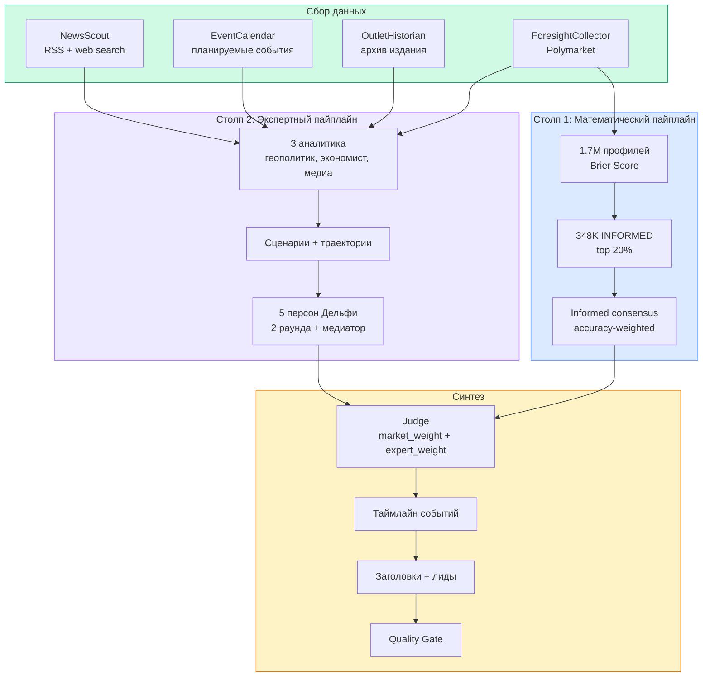
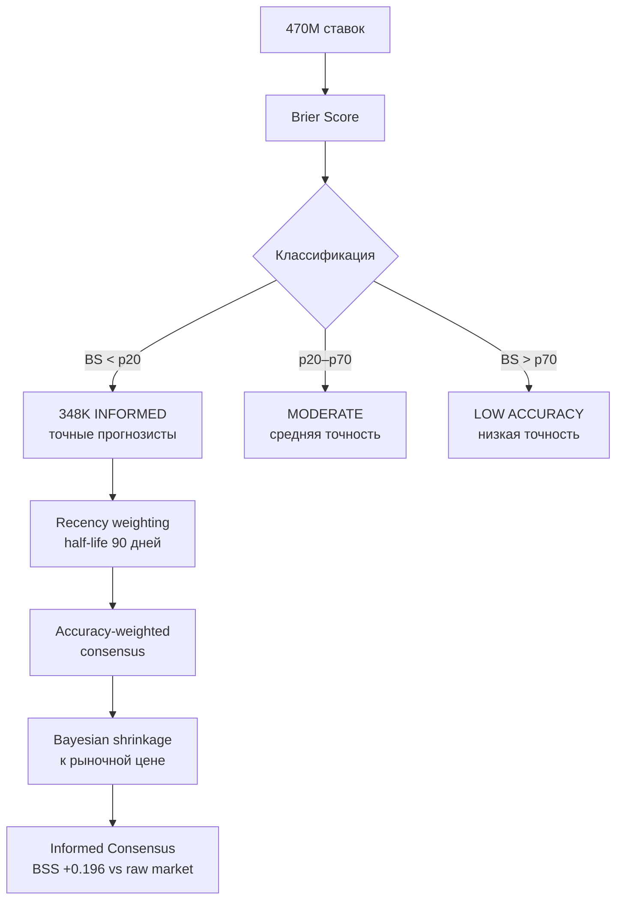

# Delphi Press

Система прогнозирования заголовков СМИ, построенная на двух столпах: математический анализ рынков прогнозов (Polymarket) и мультиагентный метод Дельфи.

18 агентов, 28 LLM-задач, 2 раунда экспертизы. Informed consensus на основе 470M исторических ставок снижает ошибку прогноза на 19.6% по сравнению с сырой рыночной ценой.

## Постановка задачи

Система решает две связанные задачи. Первая — **краткосрочный политический форсайтинг**: какие события произойдут в ближайшие N дней? Вторая — **медиа-прогноз**: как конкретное издание напишет об этих событиях, какой заголовок и первый абзац выберет редакция?

Это двухуровневая задача. Сначала система строит таймлайн развития событий с вероятностями. Затем, для каждого вероятного события, генерирует заголовок и лид в стиле указанного издания. Разные издания по-разному освещают одно и то же: один фокусируется на экономических последствиях, другой — на геополитическом контексте. Прогноз требует понимания редакционной логики.

Для решения используются **два параллельных пайплайна**: математический анализ prediction markets (Polymarket) и мультиагентный метод Дельфи. Результаты обоих объединяются в Judge — финальном синтезаторе, который строит калиброванный таймлайн событий.

<details>
<summary>Формальная постановка</summary>

Дано:
- Event thread $E$ — описание события с контекстом
- Outlet profile $\Omega_o$ — характеристика издания $o$
- Time horizon $\tau$ — целевая дата прогноза

Найти:
- Event probability $P(E \mid \tau)$ — вероятность наступления события
- Coverage probability $P(O \mid E, \Omega_o, \tau)$ — вероятность освещения
- Headline $H$ и lead $L$ в стиле издания
- Confidence, калиброванный по историческим ошибкам

Двухуровневая структура отражает реальность: событие может быть вероятным, но неинтересным для данного издания. И обратно — маловероятное событие, если произойдёт, может быть огромной новостью.

</details>

## Архитектура: два столпа



## Столп 1: Математический пайплайн

Мы профилируем 1.7M участников Polymarket по точности прогнозов и извлекаем сигнал лучших 20%.

Рыночная цена на Polymarket формируется в CLOB (Central Limit Order Book) — цена взвешена по объёмам ставок, не по точности прогнозов. Крупные спекулянты перевешивают точных аналитиков. Наше решение: два сигнала — **raw market price** и **informed consensus** (взвешенное мнение только проверенных прогнозистов). Разница между ними — мера неопределённости.

Результат: из 1.7M участников 348K классифицированы как «информированные» (top 20% по Brier Score). Их консенсус снижает ошибку прогноза на 19.6% по сравнению с сырой рыночной ценой (BSS +0.196, проверено на 22 фолдах walk-forward валидации, p = 2.38×10⁻⁷).

**Data engineering:** 470 миллионов исторических ставок (33 ГБ) обработаны через DuckDB → 2.4 ГБ bucketed parquet (30-дневные временные бакеты) → 62 МБ production-профили (ZSTD, GitHub Releases). Temporal leak обнаружен и исправлен: clean BSS (+0.117) оказался *выше* leaked (+0.092) — утечка добавляла шум, не сигнал.

**Ablation study:** простейшая модель (accuracy-weighted consensus + Bayesian shrinkage) оптимальна. Volume gate (−64% BSS), extremizing (−76%), timing score (0%) — все дополнения вредят. Extremizing Satopää et al. (2014) не работает на Polymarket, где информированные трейдеры коррелированы.



<details>
<summary>Как рассчитать informed consensus?</summary>

**Шаг 1: Brier Score каждого участника $i$**

На каждом разрешённом рынке $m$ участник делает ставку, предсказывающую вероятность $f_{i,m}$. Исход $o_m$ известен: 1 если рынок разрешился YES, 0 если NO.

$$BS_i = \frac{1}{N} \sum_{m=1}^{N} (f_{i,m} - o_m)^2$$

$BS \in [0, 1]$: 0 — идеальный прогнозист, 0.25 — случайные угадывания, 1.0 — всегда неправ.

**Шаг 2: Классификация по перцентилям**

| Класс | Порог | Описание |
|-------|-------|----------|
| INFORMED | BS < p20 | Top 20% по точности |
| MODERATE | p20–p70 | Средняя точность |
| LOW ACCURACY | BS > p70 | Низкая историческая точность |

**Шаг 3: Recency weighting — экспоненциальное затухание**

Давние ставки менее релевантны. Применяем exponential decay с half-life = 90 дней:

$$r_i = \exp\left(-0.693 \times \frac{d_i}{90}\right)$$

где $d_i$ — дней с последней ставки участника.

**Шаг 4: Accuracy-weighted consensus для активного рынка**

Для каждого INFORMED участника $i$ на активном рынке:

$$w_i = (1 - BS_i) \times v_i \times r_i$$

$$C = \frac{\sum w_i \times p_i}{\sum w_i}$$

Компоненты веса: $(1 - BS_i)$ — более точные получают выше; $v_i$ — объём (убеждённость); $r_i$ — свежесть. $C$ — informed consensus, $p_i$ — позиция участника.

**Шаг 5: Shrinkage — когда мало информированных**

Если информированных участников мало ($n < 20$), consensus ненадёжен. Применяем shrinkage:

$$\alpha = \min(1.0,\ n / 20)$$

$$P_f = \alpha \times C + (1 - \alpha) \times P_m$$

Когда участников 0 → $P_f = P_m$ (нет вреда). Когда $\geq 20$ → full trust в informed. $P_m$ — сырая рыночная цена.

**Теоретическое обоснование:**
- **Surowiecki (2004):** «Мудрость толпы» работает только при независимости и разнообразии. На рынках нарушается — есть стадное поведение.
- **Satopää et al. (2014):** Accuracy-weighting даёт точнее, чем volume-weighting или equal-weight.
- **Manski (2006):** Рынок систематически недооценивает экстремальные исходы — informed consensus помогает это исправить.

</details>

<details>
<summary>Bayesian shrinkage и архетипы трейдеров</summary>

**Проблема lucky streaks.** Участник с 3 удачными ставками получает BS ≈ 0 и попадает в INFORMED. Но при n=3 дисперсия огромна. Решение: Bayesian shrinkage (Ferro & Fricker, 2012):

$$BS_{adj} = \frac{n \times BS_{obs} + k \times \mu}{n + k}, \quad k = 15$$

При n=3 → сильный shrinkage к медиане популяции (μ = 0.295). При n=100 → почти чистый observed BS.

**6 архетипов трейдеров (HDBSCAN).** Кластеризация по 6 поведенческим признакам:

| Архетип | Характеристика |
|---------|----------------|
| `sharp_informed` | BS < 0.10, высокий объём — профессиональные арбитражёры |
| `skilled_retail` | BS < 0.15, низкий объём — точные розничные трейдеры |
| `volume_bettor` | Высокий объём, средний BS — маркет-мейкеры |
| `contrarian` | win_rate < 0.30 — систематически ошибаются |
| `stale` | Низкий recency — неактивные аккаунты |
| `noise_trader` | Всё остальное — случайные участники |

Стабильность тиров между фолдами: Jaccard = 0.613.

</details>

<details>
<summary>Параметрические модели и научная новизна</summary>

Помимо эмпирического профилирования, мы исследуем **параметрическое восстановление** субъективных распределений из ставок.

Каждый участник верит, что время до события T ~ Exp(λ). Его субъективная вероятность на горизонте H: P(T ≤ H) = 1 − exp(−λH). По наблюдаемой позиции и горизонту рынка H восстанавливаем λ.

- **Exp(λ):** closed-form MLE, Bayesian prior при n < 30
- **Weibull(λ, k):** scipy L-BFGS-B оптимизация, k > 1 = ускоряющийся hazard. Model selection по AICc (Burnham & Anderson, 2002)
- **Clone validation:** train λ на 80% рынков → predict на 20% → skill_score > 0

На момент реализации (март 2026) **нет опубликованных работ** по восстановлению Exp/Weibull распределений из ставок prediction markets.

</details>

## Столп 2: Экспертный пайплайн

> В основе экспертного пайплайна — классический **метод Дельфи**, структурированная техника группового прогнозирования, разработанная RAND Corporation в 1963 году (Dalkey & Helmer), адаптированная для ИИ-агентов.

Ключевая идея: один эксперт имеет слепые пятна. Несколько независимых экспертов с разными взглядами дают более калиброванный прогноз.

В нашей системе роль экспертов выполняют пять ИИ-агентов на базе Claude Opus 4.6 (Anthropic). Каждый имеет уникальный когнитивный профиль: реалист оценивает базовые ставки и исторические аналогии, геостратег — силовые балансы и интересы, экономист — потоки капитала и санкции, медиа-эксперт — новостную ценность и редакционную логику, адвокат дьявола — пропущенные риски и чёрных лебедей. Разнообразие перспектив минимизирует систематические ошибки одной точки зрения.

Процесс состоит из двух раундов прогнозирования. Раунд 1 — агенты независимо анализируют события. Раунд 2 — они видят аргументы друг друга (без знания авторства) и пересматривают оценки. Итоговая вероятность — взвешенная медиана с калибровкой по Brier Score каждого агента. Brier Score — стандартная метрика точности вероятностных прогнозов: чем ближе к 0, тем точнее. Случайное угадывание даёт 0.25, идеальный прогнозист — 0.

### Пять экспертов: когнитивные профили

| Эксперт | Фокус анализа | Ключевой вопрос |
|---------|---------------|-----------------|
| **Реалист-аналитик** | Базовые ставки, исторические аналогии, политические риски, инерция институтов | *«Как часто подобное происходило раньше?»* |
| **Геостратег** | Силовые балансы, стратегические интересы, альянсы, международные отношения | *«Кому выгодно? (Cui bono?)»* |
| **Экономист** | Потоки капитала, санкции, фискальная политика, товарные рынки | *«Следуй за деньгами»* |
| **Медиа-эксперт** | Новостная ценность, редакционная логика, гейткипинг, медийная насыщенность | *«Что попадёт в выпуск?»* |
| **Адвокат дьявола** | Пропущенные риски, pre-mortem анализ, контраргументы, чёрные лебеди | *«Что может пойти не так?»* |

<details>
<summary>Почему именно эти пять?</summary>

Состав вдохновлён исследованиями Tetlock и его Good Judgment Project (2005–2015). Успешные долгосрочные прогнозисты используют множество источников информации и открыты к альтернативным интерпретациям. Мы формализовали эту процедуру в пять когнитивных стилей, каждый с чётким промптом.

**AIA Forecaster** (Schoenegger et al., 2024) показал: простое усреднение нескольких запусков одной модели даёт слабое улучшение. Ключ — в **структурированном разнообразии**: когда каждый агент анализирует проблему через свою призму, они ловят разные аспекты и компенсируют слепые пятна друг друга.

**DeLLMphi** (Zhao et al., 2024) подтвердил: структурированная медиация между раундами (не просто показать чужие оценки, а заставить переосмыслить аргументы) даёт улучшение на 10–18%.

</details>

## Синтез: 9 стадий прогнозирования

Результаты обоих столпов — informed probability от Polymarket и экспертные оценки от Дельфи — объединяются в стадии Judge. Informed probability входит как «виртуальная шестая персона» с динамическим весом, зависящим от ликвидности рынка, волатильности и горизонта.

**Фаза 1: Сбор данных.** Четыре коллектора параллельно собирают новостные сигналы из RSS-фидов, поисковых систем, архивов издания и рынков прогнозов (Polymarket, Metaculus).

**Фаза 2: Анализ.** Сигналы кластеризуются в событийные нити (TF-IDF + HDBSCAN). Три аналитика параллельно строят сценарии развития: геополитический, экономический, медийный. Cross-impact matrix определяет, как события влияют друг на друга.

**Фаза 3: Дельфи-консенсус.** Пять экспертов независимо оценивают вероятности (раунд 1). Медиатор синтезирует разногласия. Эксперты пересматривают оценки (раунд 2). Judge строит **предсказанный таймлайн** — хронологию событий с вероятностями на трёх горизонтах. Калибрует вероятности, интегрирует сигналы prediction markets через market weight formula.

**Фаза 4: Генерация.** Для топ-7 событий из таймлайна система анализирует редакционный стиль целевого издания и генерирует заголовки + первые абзацы. Quality Gate проверяет факты и соответствие стилю.

<details>
<summary>Алгоритмы каждой стадии</summary>

**Стадия 1: Сбор данных.** Четыре коллектора работают параллельно: NewsScout (RSS-фиды + web search), EventCalendar (запланированные политические и экономические события), OutletHistorian (архив целевого издания за последние дни), ForesightCollector (активные контракты Polymarket и Metaculus). Результат: ~200 новостных сигналов.

**Стадия 2: Кластеризация событий.** TF-IDF векторизация с tri-gram tokenization, cosine similarity matrix, HDBSCAN (min_cluster_size=3). Выбор HDBSCAN вместо K-means: число кластеров заранее неизвестно, шумовые статьи автоматически отсеиваются (Campello et al., 2013). Результат: 15-30 событийных нитей из ~200 статей.

**Стадия 3: Cross-impact matrix.** Три аналитика (геополитический, экономический, медийный) параллельно строят сценарии. Перекрёстная матрица определяет каузальные связи: как событие A влияет на вероятность события B. Это позволяет учитывать цепочки последствий.

**Стадия 4: Дельфи — раунд 1.** Пять экспертных персон независимо оценивают вероятность каждого события: Реалист (base rates), Геостратег (баланс сил), Экономист (денежные потоки), Медиа-эксперт (новостная ценность), Адвокат дьявола (чёрные лебеди). Анонимность: персоны не видят оценки друг друга.

**Стадия 5: Медиация.** Медиатор не просто показывает чужие оценки — он синтезирует аргументы, выделяет точки разногласий и формулирует контраргументы. Это заставляет персон переосмыслить позиции, а не просто сдвинуться к среднему (Zhao et al., 2024).

**Стадия 6: Консенсус и таймлайн.** Judge агрегирует оценки в предсказанный таймлайн на трёх горизонтах: 1-2 дня (оперативный режим, высокий вес), 3-4 дня (смешанный режим), 5-7 дней (структурный режим, низкий вес). Калибрует вероятности, интегрирует сигналы prediction markets через market weight formula.

**Стадия 7: Фрейминг.** Анализ редакционного стиля целевого издания: жанр, типичная длина заголовков, лексика, тональность, характерные углы подачи. Для каждого события определяется фрейм: угроза, возможность, кризис, рутина или сенсация.

**Стадия 8: Генерация заголовков.** StyleReplicator генерирует заголовки и первые абзацы в стиле целевого издания. Каждый заголовок стилизуется под конкретный формат: длина, лексика, тональность соответствуют профилю СМИ.

**Стадия 9: Quality Gate.** Алгоритмическая проверка (без LLM): факт-чек заголовка по source data, стилевая consistency (длина, лексика, тональность vs. профиль издания). Заголовки ниже порога отбраковываются.

Общее время: 15-40 минут. Стоимость: $5-15 за полный прогноз. 18 агентов, 28 LLM-задач.

</details>

## Walk-Forward валидация

Любой метод требует доказательства. Мы провели строгую ретроспективную валидацию informed consensus на полном архиве Polymarket — 435 тысяч разрешённых рынков.

Протокол walk-forward evaluation моделирует реальную эксплуатацию: система строит профили только на данных из прошлого, затем прогнозирует на новых рынках, сдвигает окно вперёд и повторяет. 22 неперекрывающихся 60-дневных фолда, burn-in 180 дней.

| Метрика | Значение |
|---------|----------|
| Фолдов BSS > 0 | **22/22 (100%)** |
| Средний BSS | **+0.196** |
| Bootstrap 95% CI | [+0.135, +0.260] |
| Sign test p-value | 2.38×10⁻⁷ |
| Робастный BSS (фолды 0–16) | +0.127 |
| Пик BSS | +0.273 (fold 9) |

<details>
<summary>Temporal leak и ablation study</summary>

**Temporal leak:** обнаружен look-ahead bias — pre-aggregated позиции включали ставки после temporal cutoff. Исправлено через bucketed partial aggregates (30-day time buckets). Clean BSS (+0.117) *выше* leaked (+0.092) — утечка добавляла шум, не помогала.

**Ablation study (5 вариантов, bootstrap CI):**

| Вариант | BSS mean | BSS > 0 | 95% CI |
|---------|----------|---------|--------|
| **Baseline** | **+0.196** | **100%** | **[+0.135, +0.260]** |
| Volume gate | +0.071 | 95.5% | [+0.040, +0.102] |
| Gate + extremize | +0.047 | 68.2% | [+0.022, +0.075] |
| Gate + timing | +0.071 | 95.5% | [+0.040, +0.102] |
| Все три | +0.047 | 68.2% | [+0.022, +0.075] |

Baseline оптимален. Extremizing (Satopää 2014) не работает на Polymarket — информированные трейдеры коррелированы. Volume gate убирает информативные рынки. Простейшая модель — лучшая.

</details>

<details>
<summary>Сравнение с литературой</summary>

| Исследование | Находка | Наш результат |
|---|---|---|
| Satopää et al. (2014) | Extremizing +10–20% в турнирах | Extremizing **вредит** (−76% BSS) — трейдеры коррелированы |
| Akey et al. (2025) | Top 1% Polymarket захватывает 84% прибыли | Подтверждает tier-based profiling |
| Mitts & Ofir (2026) | Flagged traders: 69.9% win rate, $143M аномальной прибыли | Информированные трейдеры существуют и систематически точнее |
| Clinton & Huang (2024) | Polymarket 67% accuracy vs PredictIt 93% | Volume gate не универсален |
| Bürgi et al. (2025) | Цены точнее ближе к разрешению | Обосновывает recency weighting |

</details>

## Horizon-aware прогнозирование

Не все события одинаково предсказуемы. Завтрашнее заседание парламента предсказать проще, чем последствия через неделю. Система учитывает это, разделяя прогноз на три временных горизонта.

| Горизонт | Вес в оценке | Характеристика |
|----------|-------------|----------------|
| **1-2 дня** | Высокий | Оперативный режим. Больше данных, выше точность. Основная часть прогноза. |
| **3-4 дня** | Средний | Смешанный режим. Сценарии развития + каузальные цепочки. |
| **5-7 дней** | Низкий | Структурный режим. Высокая неопределённость. Опирается на тренды. |

## Валидация и метрики

Система оценивается по трём компонентам: калибровка вероятностей, семантическое сходство заголовков и стилевая аутентичность.

**Brier Score (BS)** — стандартная метрика для прогнозов вероятностей. BS = 0.20 означает, что модель на 20% ошибается в среднем. Цель v1.0: BS < 0.20 (уровень Metaculus-сообщества).

**BERTScore** — сравнивает сгенерированный заголовок с фактически опубликованным через контекстные эмбеддинги. Более точно, чем n-gram метрики (ROUGE, BLEU), для коротких текстов.

**StyleMatch** — отдельная LLM-модель оценивает, насколько хорошо заголовок соответствует стилю издания (длина, лексика, структура, тональность). Шкала 1–5.

<details>
<summary>Подробные формулы и бенчмарки</summary>

**CompositeScore — взвешенная комбинация**

CompositeScore = 0.40 × TopicMatch + 0.35 × SemanticSim + 0.25 × StyleMatch

| Компонент | Диапазон | Описание |
|-----------|----------|----------|
| TopicMatch | {0.0, 0.5, 1.0} | 0 = промах; 0.5 = верная тема, неверный исход; 1.0 = попадание |
| SemanticSim | [0.0, 1.0] | BERTScore F1 vs. лучший совпадающий реальный заголовок |
| StyleMatch | [0.0, 1.0] | LLM-as-judge (1–5 → /5) |

Пороги: ≥0.70 отличный, 0.50–0.69 хороший, 0.30–0.49 частичное, <0.30 промах.

**Brier Score и BSS (Brier Skill Score)**

$$BS = \frac{1}{N} \sum_{i=1}^{N} (f_i - o_i)^2$$

$$BSS = 1 - \frac{BS}{BS_{ref}}, \quad BS_{ref} = 0.25$$

где $BS_{ref}$ — baseline (случайные угадывания).

BSS = 0.20 означает 20% улучшение vs. случайного прогноза.

**Murphy Decomposition — диагностика ошибок**

BS = Reliability − Resolution + Uncertainty

- Reliability > 0.05: система переоценивает уверенность → требуется Platt scaling
- Resolution < 0.10: система слишком осторожна → нужна экстремизация вероятностей
- Uncertainty: неизбежная ошибка, зависит от самой задачи

**Benchmark: как мы сравниваемся с другими**

| Система | Brier Score | Контекст |
|---------|-------------|----------|
| Случайное угадывание | 0.25 | Baseline |
| Metaculus (сообщество) | 0.182 | Broad participation |
| **Delphi v1.0 (target)** | **< 0.20** | **Уровень prediction market** |
| GPT-4.5 (ForecastBench) | 0.101 | ICLR 2025 (arxiv 2409.19839) |
| Суперпрогнозисты (GJP) | 0.068–0.086 | Tetlock, 15 лет |

</details>

## Быстрый старт

### Вариант 1: Web UI

Откройте [https://delphi.antopkin.ru](https://delphi.antopkin.ru), введите свой API-ключ OpenRouter, выберите издание и горизонт прогноза.

### Вариант 2: CLI (E2E dry run)

```bash
git clone https://github.com/Antopkin/delphi-press.git
cd delphi-press
uv sync

# Скачать базу профилей суперпрогнозистов Polymarket (62 MB, однократно)
uv run python scripts/download_profiles.py

# Быстрый smoke test (gemini-flash, 5 потоков событий, ~$0.25)
export OPENROUTER_API_KEY="sk-..."
uv run python scripts/dry_run.py --outlet "ТАСС" --model google/gemini-2.5-flash --event-threads 5

# Production-like запуск (Claude Opus, полный pipeline, 20 потоков, ~$5-15)
uv run python scripts/dry_run.py --outlet "BBC News" --model anthropic/claude-opus-4.6
```

**Требует**: `OPENROUTER_API_KEY` в окружении. Скрипт запускает Orchestrator напрямую, минуя API/Redis/Docker.

### Вариант 3: Docker Compose (production)

```bash
docker compose up -d
# Откроется на http://localhost:8000
# Профили суперпрогнозистов скачаются автоматически при первом запуске
```

## Статус

v0.9.5 (март 2026). Python 3.12+, FastAPI, Claude/GPT-4/Gemini через OpenRouter.

- 1318 unit + integration тестов, все green
- 9/9 стадий pipeline verified, 18 агентов, 28 LLM-задач
- Inverse Problem: walk-forward eval, **22/22 фолда BSS > 0**, mean +0.196, p = 2.38×10⁻⁷
- Data: 470M trades обработаны, 348K informed из 1.7M трейдеров Polymarket
- Ablation: baseline оптимален, extremizing/volume gate/timing вредят
- Deployed: [delphi.antopkin.ru](https://delphi.antopkin.ru) (live)
- Подробная спецификация: `docs/` (12 файлов)

## Источники и литература

**Метод Дельфи:**
- Dalkey & Helmer (1963). «An Experimental Application of the Delphi Method to the Use of Experts.» RAND Corporation.
- Rowe & Wright (2001). «Expert opinions in forecasting: the role of the Delphi technique.» Technological Forecasting and Social Change.

**LLM-агенты и прогнозирование:**
- Schoenegger et al. (2024). «AIA Forecaster: Accuracy Improvement through LLM Ensemble.» ICML.
- Zhao et al. (2024). «DeLLMphi: Delphi-style Iterative Refinement with Large Language Models.» NeurIPS.
- Tetlock & Gardner (2015). «Superforecasting: The Art and Science of Prediction.» Crown.

**Рынки прогнозов и wise crowds:**
- Surowiecki (2004). «The Wisdom of Crowds.» Doubleday.
- Satopää et al. (2014). «Combining Multiple Probability Predictions Using Their Cumulative Distribution Functions.» International Journal of Forecasting.
- Manski (2006). «Interpreting Probability Statements from Markets: The Case of Mortgage-Backed Securities.» The Economic Journal.
- Wolfers & Zitzewitz (2004). «Prediction Markets.» Journal of Economic Literature.

**Оценка прогнозов:**
- Gneiting & Raftery (2007). «Strictly Proper Scoring Rules, Prediction, and Estimation.» JASA.
- Murphy (1971). «A New Vector Partition of the Probability Score.» Journal of Applied Meteorology.
- Ye et al. (2024). «ForecastBench: A Comprehensive Benchmark of Forecasting Capabilities of Language Models.» ICLR 2025 (arxiv 2409.19839).

**Семантическое сходство текстов:**
- Zhang* et al. (2020). «BERTScore: Evaluating Text Generation with BERT.» ICLR 2020.
- Lin (2004). «ROUGE: A Package for Automatic Evaluation of Summaries.» ACL Text Summarization Workshop.

**LLM как судья:**
- Zhong et al. (2023). «LLMs as Factual Reasoners: Evaluating their Free-text Justifications.» ICLR 2023 Oral.
- Liu et al. (2023). «G-Eval: NLG Evaluation using GPT-4 with Better Human Alignment.» EMNLP 2023.

**Статистика и model selection:**
- Ferro & Fricker (2012). «Sampling Uncertainty and Confidence Intervals for the Brier Score.» Weather and Forecasting.
- Burnham & Anderson (2002). «Model Selection and Multimodel Inference.» Springer.
- Campello et al. (2013). «Density-Based Clustering Based on Hierarchical Density Estimates.» PAKDD.

**Эмпирика prediction markets:**
- Akey, Grégoire, Harvie & Martineau (2025). «Who Wins and Who Loses in Prediction Markets? Evidence from Polymarket.» SSRN 6443103.
- Mitts & Ofir (2026). «From Iran to Taylor Swift: Informed Trading in Prediction Markets.» Harvard Law Corporate Governance Forum.
- Bürgi, Deng & Whelan (2025). «Makers and Takers: The Economics of the Kalshi Prediction Market.» CEPR.
- Clinton & Huang (2024). «Polymarket Accuracy Study.» Vanderbilt University.

**Imitation Learning и opinion pooling:**
- Genest & Zidek (1986). «Combining Probability Distributions: A Critique and an Annotated Bibliography.» Statistical Science.
- Cooke (1991). «Experts in Uncertainty.» Oxford University Press.

## Документация

- [Architecture](docs/architecture.md) — 9 стадий, 28 LLM-задач, data flow
- [Delphi Method](docs/05-delphi-pipeline.md) — методология, персоны, промпты
- [Inverse Problem](docs/methodology-inverse-problem.md) — Polymarket profiling, Brier Score
- [Evaluation](tasks/research/retrospective_testing.md) — протокол валидации, бенчмарки
- [Glossary](GLOSSARY.md) — все доменные термины
- [API Backend](docs/08-api-backend.md) — аутентификация, endpoints, схемы

Полный список — в [docs/](docs/).

## Замечание

> Delphi Press — исследовательский прототип. Все прогнозы имеют ошибку. Система предназначена для изучения методов мультиагентного прогнозирования.

## Автор

[@Antopkin](https://t.me/Antopkin) — Telegram

## Лицензия

Proprietary. All rights reserved.
