# Delphi Press

Система прогнозирования заголовков СМИ, основанная на методе Дельфи и анализе предиктивных рынков.

Не хаотичное генерирование текста. Структурированная методология, 18 агентов, 2 раунда экспертизы, интеграция сигналов от профилированных участников prediction markets.

---

## Как это работает

```mermaid
graph LR
    A["1. Сбор данных<br/>RSS, Web Search<br/>Профиль издания"] -->|Signals| B["2. Идентификация событий<br/>Кластеризация TF-IDF<br/>+ HDBSCAN"]
    B -->|EventThreads| C["3. Анализ траектории<br/>3 аналитика<br/>Crossimpact matrix"]
    C -->|Trajectories| D["4. Дельфи R1<br/>5 персон независимо<br/>Разные LLM-модели"]
    D -->|Assessments| E["5. Медиация & R2<br/>Синтез расхождений<br/>Пересмотр оценок"]
    E -->|Consensus| F["6. Судья<br/>Агрегация по Brier<br/>Informed markets"]
    F -->|Predictions| G["7-9. Генерация<br/>Фрейминг → Заголовки<br/>Fact-check → QA"]
    G --> H["Финальные прогнозы<br/>Ранжированные<br/>Калиброванные"]
```



**Девять стадий. 18 LLM-вызовов. Проверено на 1000+ тестах.**

---

## Методология: по шагам

### 1. Собираем сигналы

Сбор новостей из 4 источников параллельно: текущие новости (RSS, web search), календарь значимых дат (политические события, экономические релизы), история конкретного издания (чтобы понять стиль), историческая база с Metaculus и Polymarket.

**Выход**: ~200 новостных сигналов за целевой период.

### 2. Кластеризуем в события

Используем TF-IDF векторизацию + HDBSCAN для выделения тематических кластеров. Система определяет, что 50 мелких новостей про санкции — это на самом деле одно событие, которое может привести к заголовку.

**Выход**: 10-25 различимых событийных потоков (event threads).

### 3. Анализируем траектории

Три специализированных агента анализируют одно и то же событие с разных углов:
- Геополитический стратег: баланс сил, стратегические интересы
- Экономист: денежные потоки, санкции, товарные рынки
- Медиа-эксперт: новостная ценность, как издание будет о нём писать

Также строим матрицу перекрёстных влияний: если произойдёт A, как изменится вероятность B?

**Выход**: Детальные траектории для каждого события (baseline, optimistic, pessimistic сценарии).

### 4-5. Дельфи: два раунда экспертизы

#### Раунд 1 (независимое оценивание)

Пять экспертных персон дают свои оценки вероятности каждого события:

| Персона | Роль | Где выигрывает |
|---------|------|----------------|
| Реалист-аналитик | Base rates, исторические прецеденты | Стабильные события, инерция |
| Геостратег | Баланс сил, "Cui bono?" | Геополитические события |
| Экономист | Потоки денег, санкции | Экономические шоки |
| Медиа-эксперт | Новостная ценность | Сенсации, тренды |
| Адвокат дьявола | Чёрные лебеди, pre-mortem | Рисковые сценарии |

Каждый агент работает на **отдельной LLM-модели** (Claude Opus 4.6). Модельное разнообразие — критически важно. Иначе ошибки скоррелируют, и ансамбль не добавит ценности.

Анонимность: персоны не видят друг друга. Нет стадного поведения.

#### Раунд 2 (пересмотр с синтезом)

Между раундами — **медиация**. Не просто статистика ("вот медиана группы"), а содержательный синтез:
- Где эксперты согласны (spread < 0.15) — consensus, не требует пересмотра
- Где расходятся (spread > 0.30) — медиатор формулирует **конкретные фактические вопросы**: "Примет ли ЦБ это решение в апреле или мае? От чего это зависит?"

Персоны видят эти вопросы (без знания чужих имён) и пересматривают оценки обоснованно, а не просто двигают числа к медиане.

**Научная база**: исследование DeLLMphi (Zhao et al., 2024) показало, что без содержательной медиации улучшения минимальны. С медиацией — вероятности становятся стабильнее и точнее.

### 6. Судья: агрегация и калибровка

Судья собирает оценки и:

1. **Определяет консенсус** — какие события скорее всего произойдут
2. **Выбирает топ-7** — самые вероятные события
3. **Добавляет дикие карты** — контрариан-прогнозы от адвоката дьявола (макс. 2 шт.)
4. **Калибрует вероятности** — корректирует на исторический Brier Score каждой персоны
5. **Обогащает рыночными сигналами** — если на Polymarket торгуется связанный контракт, интегрирует вероятность плюс сигнал от профилированных участников

#### Inverse Problem: мудрость информированных

470M торговых записей с Polymarket. Из них выделили **348K информированных участников** через Brier Score профилирование:

- **Informed top 20%**: исторически точные трейдеры, средний BS < 0.08
- **Noise (bottom 30%)**: спекулянты, BS > 0.20

Для каждого активного рынка вычисляем **informed consensus**: взвешенную вероятность только от точных участников, игнорируя шум.

**Результат**: Brier Skill Score **+0.196** (mean), CI [+0.091, +0.263]. Informed consensus на 20% точнее рыночной цены в ретроспективном тестировании на 22 временных фолдах.

Сравнение с бенчмарками:
- Polymarket (общий): BS ≈ 0.187
- Metaculus-сообщество: BS = 0.182
- Superforecasters (GJP): BS = 0.068–0.086
- **Delphi + informed**: BS < 0.20 (v1.0 target)

### 7-9. Генерация, фрейминг, QA

Для каждого топ-события система:

1. Анализирует стиль конкретного издания (жанр, длина заголовков, лексика, тональность)
2. Формулирует **фрейм** (угол подачи): угроза ли это, возможность, кризис, рутина или сенсация?
3. Генерирует 2-3 варианта заголовка в стиле издания + первый абзац
4. Fact-check: проверяет логическую согласованность с событием
5. Style-check: проверяет соответствие стилю издания

**Выход**: 7-9 финальных прогнозов, каждый с вероятностью, цепочкой обоснования и сгенерированным заголовком на языке целевого издания.

---

## Оценка качества

### Бенчмарки (Brier Score)

| Уровень | BS | Контекст |
|---------|-----|---------|
| Случайное угадывание | 0.25 | Всегда 50% |
| Polymarket (сырая цена) | ~0.187 | Реальные деньги |
| Metaculus-сообщество | 0.182 | Краудсорс, тысячи участников |
| **Delphi v1.0 (target)** | **< 0.20** | **Уровень prediction market** |
| GJP top forecasters | ~0.14 | Обученные эксперты |
| GPT-4.5 (ForecastBench) | 0.101 | Лучший LLM на сегодня |
| **Delphi v2.0 (амбиция)** | **< 0.12** | **Уровень обученных прогнозистов** |
| Superforecasters | 0.068–0.086 | Долгосрочный ориентир |

**BS < 0.20 — критерий успеха**: это означает, что система предсказывает не хуже сообщества на Metaculus и лучше среднего участника Polymarket.

### Составной скор

```
CompositeScore = 0.40 × TopicMatch + 0.35 × SemanticSim + 0.25 × StyleMatch
```

- **TopicMatch** (0–1): совпадает ли событие с фактически опубликованной новостью
- **SemanticSim** (0–1): BERTScore F1 между спрогнозированным и реальным заголовком
- **StyleMatch** (0–1): соответствие стилю издания (оценка LLM-судьи)

---

## Архитектура

| Слой | Технология |
|------|-----------|
| **Язык** | Python 3.12+ |
| **Backend** | FastAPI + ARQ (Redis, background tasks) |
| **БД** | SQLite + SQLAlchemy 2.0 (async) |
| **Валидация** | Pydantic v2 |
| **LLM** | OpenRouter (Claude, GPT-4, Gemini) |
| **Frontend** | Tailwind CSS v4 + Vanilla JS |
| **Деплой** | Docker Compose (4 контейнера) |
| **Сервер** | Debian 12, static IP, hardened (fail2ban, firewall) |
| **Языки** | Русский (интерфейс), английский/русский (результаты) |

Модульный монолит. 18 агентов, 9 стадий, централизованный LLM-роутер с контролем бюджета и fallback-цепочками.

---

## Быстрый старт

### Вариант 1: Web UI

Откройте [https://delphi.antopkin.ru](https://delphi.antopkin.ru), введите свой API-ключ OpenRouter, выберите издание и горизонт прогноза.

### Вариант 2: CLI (E2E dry run)

```bash
git clone https://github.com/Antopkin/delphi-press.git
cd delphi-press
uv sync

# Быстрый smoke test (gemini-flash, 5 потоков событий, ~$0.25)
export OPENROUTER_API_KEY="sk-..."
uv run python scripts/dry_run.py --outlet "ТАСС" --model google/gemini-2.5-flash --event-threads 5

# Production-like запуск (Claude Opus, полный pipeline, 20 потоков, ~$5-15)
uv run python scripts/dry_run.py --outlet "BBC News" --model anthropic/claude-opus-4.6
```

**Требует**: `OPENROUTER_API_KEY` в окружении. Скрипт запускает Orchestrator напрямую, минуя API/Redis/Docker.

### Вариант 3: Docker Compose (production)

```bash
docker compose up -d
# Откроется на http://localhost:8000
```

---

## Что пример выдаёт

Для запроса "ТАСС, горизонт 7 дней, 20 событийных потоков" система возвращает:

```json
{
  "outlet": "ТАСС",
  "target_date": "2026-04-05",
  "predictions": [
    {
      "rank": 1,
      "event": "Решение ЦБ по ставке",
      "confidence": 0.74,
      "agreement_level": "consensus",
      "reasoning": "Реалист + Экономист: базовая ставка + календарь. Геостратег ниже (0.65) из-за неопределённости по новым санкциям.",
      "headline": "ЦБ повысил ключевую ставку на 0.5% до 21.5%",
      "first_paragraph": "Центральный банк России принял решение...",
      "headline_confidence": 0.88,
      "style_fit": 0.92
    },
    {
      "rank": 2,
      "event": "Встреча с иностранной делегацией",
      "confidence": 0.62,
      "agreement_level": "contested",
      "reasoning": "Реалист + Геостратег: плановая встреча (high base rate). Адвокат дьявола ниже (0.45): может отменить в последний момент.",
      "headline": "Россия и Индия обсудили расширение сотрудничества",
      "first_paragraph": "...",
      "headline_confidence": 0.76,
      "style_fit": 0.84
    },
    ...
  ],
  "pipeline_info": {
    "total_signals_collected": 187,
    "event_threads_identified": 18,
    "delphi_r1_duration_ms": 2840,
    "delphi_r2_duration_ms": 1920,
    "total_cost_usd": 3.47,
    "tokens_in": 145230,
    "tokens_out": 18640
  }
}
```

---

## Статус

v0.9.2 (март 2026):

- 1102 unit + integration тестов, все green
- 9/9 стадий pipeline verified
- Inverse Problem: walk-forward eval, 22/22 фолда BSS > 0.
- Deployed: delphi.antopkin.ru (live)
- Подробная спецификация: `docs/` (12 файлов)

**Не готово**: полная галерея примеров на реальных данных (требует исторического Wayback Machine snapshots).

---

## Документация

Полная спецификация каждого модуля:

- [Architecture](docs/architecture.md) — 9 стадий, 28 LLM-задач, data flow
- [Delphi Method](docs/05-delphi-pipeline.md) — методология, персоны, промпты
- [Inverse Problem](docs/methodology-inverse-problem.md) — Polymarket profiling, Brier Score
- [Evaluation](tasks/research/retrospective_testing.md) — протокол валидации, бенчмарки
- [Glossary](GLOSSARY.md) — все доменные термины
- [API Backend](docs/08-api-backend.md) — аутентификация, endpoints, схемы

Полный список — в [docs/](docs/).

---

## Для фестиваля прогнозов: что здесь нового

1. **Методология, не спекуляция**: Дельфи-метод (1963) + медиация (DeLLMphi, 2024) на практике
2. **Модельное разнообразие**: 5 персон, разные когнитивные смещения, одна LLM-архитектура
3. **Калибровка через историю**: каждая персона получает вес по эмпирическому Brier Score (после накопления данных)
4. **Рыночные сигналы**: 348K профилированных участников Polymarket, informed consensus добавляет +20% точности
5. **Полный pipeline**: от сбора сигналов до сгенерированного заголовка в стиле конкретного издания

Это не "спросим GPT и выставим его выход". Это structured ensemble forecasting.

---

## Автор

[@Antopkin](https://t.me/Antopkin) — Telegram

---

## Лицензия

Proprietary. All rights reserved.
